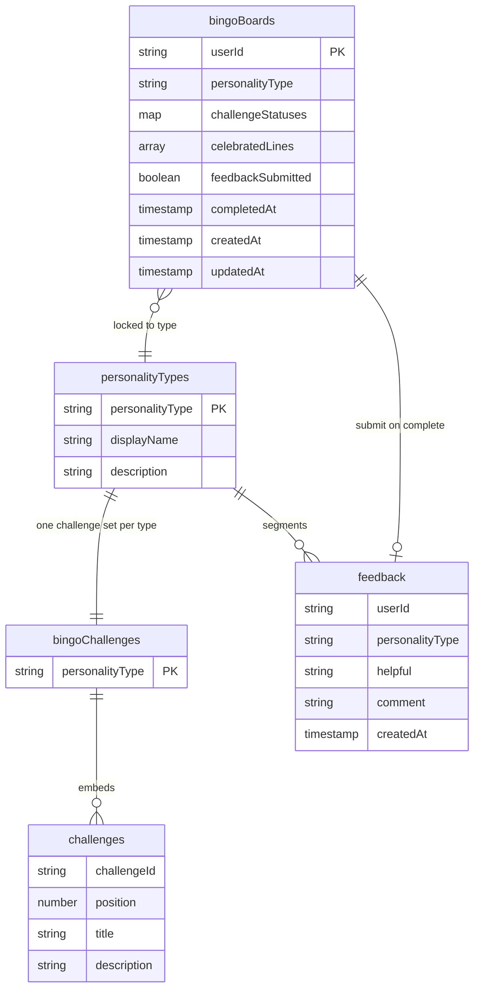

# Emoot Bingo - Data Model

Firestore collections for Emoot Bingo: the nine challenges per personality type, each user's board (locked to their quiz result), and the feedback they leave when a board is complete. The board extends the quiz model - it hangs off the user's personality result. Bingo is played after sign-in, so board and feedback access are per-user. How these map onto Emoot's existing Firestore is documented separately under [integration](../integration/).

## Collections

### `bingoChallenges/{TYPE}`

The nine challenges for one personality type, embedded so a single read returns the whole set (mirrors the quiz's embedded options).

| Field           | Type                   | Notes                       |
| --------------- | ---------------------- | --------------------------- |
| personalityType | string                 | document id (UPPERCASE key) |
| challenges      | array&lt;Challenge&gt; | the nine, embedded          |

**Challenge (embedded):**

| Field       | Type   | Notes           |
| ----------- | ------ | --------------- |
| challengeId | string |                 |
| position    | number | 0-8, board cell |
| title       | string |                 |
| description | string |                 |

Position 4 (the centre) is the fixed challenge "create and share an Emoot savings goal" - the same text for every type - and is rendered with that type's face, a frontend asset keyed by `personalityType` (not stored).

### `bingoBoards/{uid}`

A user's board, keyed by Auth UID. The board locks to the user's **first** personality result and is immutable on retake (a retake replaces the quiz result but does not change or reset the board).

| Field             | Type      | Notes                                                                                                  |
| ----------------- | --------- | ------------------------------------------------------------------------------------------------------ |
| userId            | string    | == uid                                                                                                 |
| personalityType   | string    | locked to the first result; not changed on retake                                                      |
| challengeStatuses | map       | `{ challengeId: "NOT_STARTED" \| "COMPLETED" }` - binary                                               |
| celebratedLines   | array     | line ids already celebrated (e.g. `["row0","col2"]`) so each 3-in-a-row fires once across sessions     |
| feedbackSubmitted | boolean   | true once feedback is given - lets the completion screen skip re-prompting without querying `feedback` |
| completedAt       | timestamp | set when all nine are COMPLETED                                                                        |
| createdAt         | timestamp | board created on first bingo entry                                                                     |
| updatedAt         | timestamp |                                                                                                        |

Board completion is **derived** from the nine statuses - there is no stored completion enum. `challengeStatuses` is a map, not an array, so a single challenge can be toggled with one field write.

### `feedback/{autoId}`

Board feedback, collected and processed by the client. A separate collection rather than a board field, so it can be queried and aggregated without touching user documents - Firestore has no server-side aggregation, so analytics data belongs on its own.

| Field           | Type           | Notes                                                                            |
| --------------- | -------------- | -------------------------------------------------------------------------------- |
| userId          | string         | who submitted                                                                    |
| personalityType | string         | segments the analysis                                                            |
| helpful         | string         | `"UP" \| "DOWN"` - a SKIP writes no document                                     |
| comment         | string \| null | reserved for the future "leave your feedback" free-text; `null` until that ships |
| createdAt       | timestamp      |                                                                                  |

Written once when the user submits UP/DOWN on the Board Complete screen.

## Main read

A user's board renders in two reads:

1. The board: `bingoBoards/{uid}` - carries the locked type, the nine statuses, and the celebrated lines.
2. The challenges for that type: `bingoChallenges/{TYPE}` - all nine arrive embedded.

Statuses live on the board (a map, individually updatable); challenge content is denormalized into the type document because it is small, fixed, and always read together.

## Access

- `bingoBoards/{uid}` - readable and writable only by its owner (`uid == request.auth.uid`).
- `feedback` - a signed-in user may create their own document (`userId == request.auth.uid`); reads are admin-only (Nik), not client-readable.
- `bingoChallenges` - read-only to signed-in users (bingo is played after sign-in); writes are seed/admin only.

All access goes through the service layer ([ADR-0002](../adr/0002-service-layer-boundary.md)); components never touch Firestore directly.

## ER diagram

Challenges are shown as an entity for clarity, but they are embedded inside the `bingoChallenges` document, not a separate collection. The board's `personalityType` is a snapshot of the user's first quiz result.
