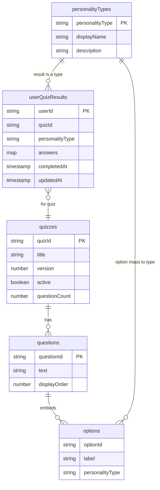

# Money Personality Quiz - Data Model

Firestore collections for the Money Personality Quiz: the quiz content, the four personality result definitions, and each user's saved result. Per-user data is keyed by the Firebase Auth UID, and all reads and writes go through the service layer ([ADR-0002](../adr/0002-service-layer-boundary.md)). How these map onto Emoot's existing Firestore is documented separately under [integration](../integration/).

## Conventions

- Personality type keys are UPPERCASE: `PLANNER`, `WORRIER`, `FREE_SPIRIT`, `OVERWHELMED_STARTER`.
- Field names are camelCase.
- A user's answers are stored as a map `{ questionId: optionId }`.

## Collections

### `quizzes/{quizId}`

The quiz container and its metadata. Even with a single quiz today, this gives quiz-level data a home and allows versioning and an active toggle.

| Field         | Type    | Notes                  |
| ------------- | ------- | ---------------------- |
| quizId        | string  | document id            |
| title         | string  |                        |
| version       | number  | bump on content change |
| active        | boolean | which quiz is live     |
| questionCount | number  |                        |

### `quizzes/{quizId}/questions/{questionId}` (subcollection)

Questions belong to a quiz, so they are a subcollection - the one place nesting is correct here, since questions are only ever read per quiz. Options are embedded in the question document.

| Field        | Type                | Notes                            |
| ------------ | ------------------- | -------------------------------- |
| questionId   | string              | document id                      |
| text         | string              | question text                    |
| displayOrder | number              | order within the quiz            |
| options      | array&lt;Option&gt; | embedded; read with the question |

**Option (embedded):**

| Field           | Type   | Notes                                     |
| --------------- | ------ | ----------------------------------------- |
| optionId        | string |                                           |
| label           | string | answer text                               |
| personalityType | string | the type this option maps to (one-to-one) |

### `personalityTypes/{TYPE}`

The four result definitions. This is editable content, so it lives in the database.

| Field           | Type   | Notes                       |
| --------------- | ------ | --------------------------- |
| personalityType | string | document id (UPPERCASE key) |
| displayName     | string | e.g. "The Planner"          |
| description     | string | result copy                 |

### `userQuizResults/{uid}`

A user's saved result, keyed by Auth UID: one document per user, a direct lookup, and clean per-user security.

| Field           | Type      | Notes                      |
| --------------- | --------- | -------------------------- |
| userId          | string    | == uid                     |
| quizId          | string    | which quiz was taken       |
| personalityType | string    | the result                 |
| answers         | map       | `{ questionId: optionId }` |
| completedAt     | timestamp | first completion           |
| updatedAt       | timestamp | updated on retake          |

On retake, this document is replaced - the new result supersedes the old.

## Main read

Rendering the quiz and result takes a small, bounded number of reads:

1. The quiz: `quizzes/{quizId}` plus its `questions` subcollection. Options arrive embedded, so there are no extra reads for them.
2. The user's saved result, if signed in: `userQuizResults/{uid}`.

Options are denormalized into the question document because they are small, bounded, and always read together with the question - trading a little redundancy for one read instead of many, the standard Firestore denormalize-for-reads tradeoff.

## Access

The quiz is taken without an account, so the quiz content is publicly readable; only the user's saved result is protected. See [ADR-0004](../adr/0004-public-read-quiz-content.md).

- `quizzes`, `questions`, `personalityTypes` - **publicly readable** (a visitor takes the quiz before signing in); writes are seed/admin only.
- `userQuizResults/{uid}` - readable and writable only by its owner (`uid == request.auth.uid`).

All access goes through the service layer ([ADR-0002](../adr/0002-service-layer-boundary.md)); components never touch Firestore directly.

## ER diagram

Options are shown as an entity for clarity, but they are embedded inside the question document, not a separate collection.
